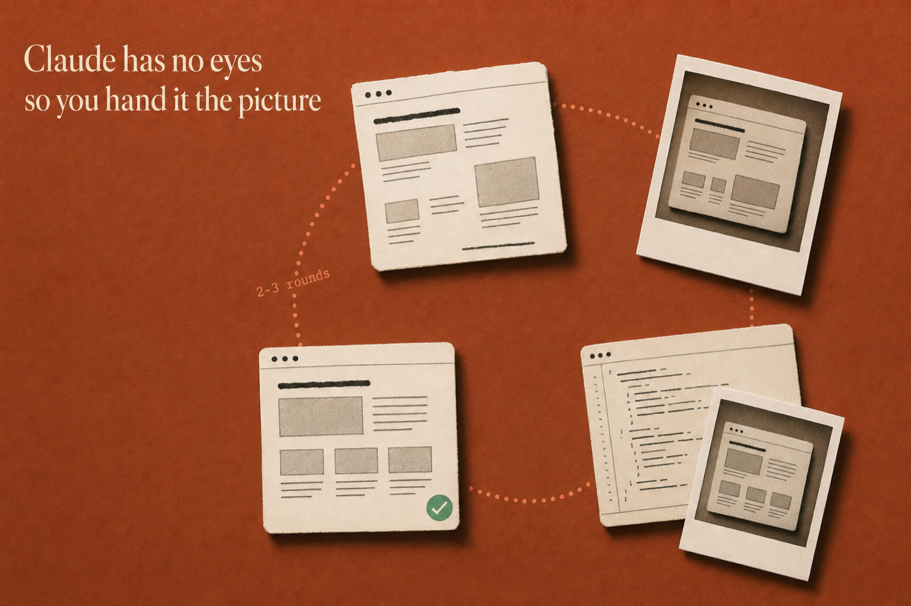

# Chapter 4: Fix the Ugly

## What you build

A design system Claude follows, and the habit of handing it a picture instead of arguing with
it. Claude writes correct CSS and cannot see the result, which is how "the buttons are
identical" and "they're clearly 10px off" end up both being true.



## Start here

Copy `design-system.md` into your project root, add the `## Design` block from the bottom of
it to your CLAUDE.md, then paste:

```
Restyle the entire task list page using the design system. Use cards for each task. Apply the color-coded status badges.
```

Then run the loop in `screenshot-loop.md`: screenshot, hand over the image, critique, reload.

## Done when

Claude comes back with specific observations (uneven card spacing, a low-contrast badge, a
shadow heavier on one side) rather than generalities. Generalities mean your file path was
wrong, not that the page is fine. Two or three rounds gets you about 80% of the way there.

## On your own project

`design-system.md` here is the Task Tracker's, with its three status names baked in. The
project-neutral version is `starter-kit/design-system.md`, which the installer puts in your
project root. Swap the ten hex values for your own palette and keep every heading, because
the headings are what Claude reads.

`common-visual-problems.md` transfers unchanged: five one-liners you paste at whatever page
is currently ugly.
