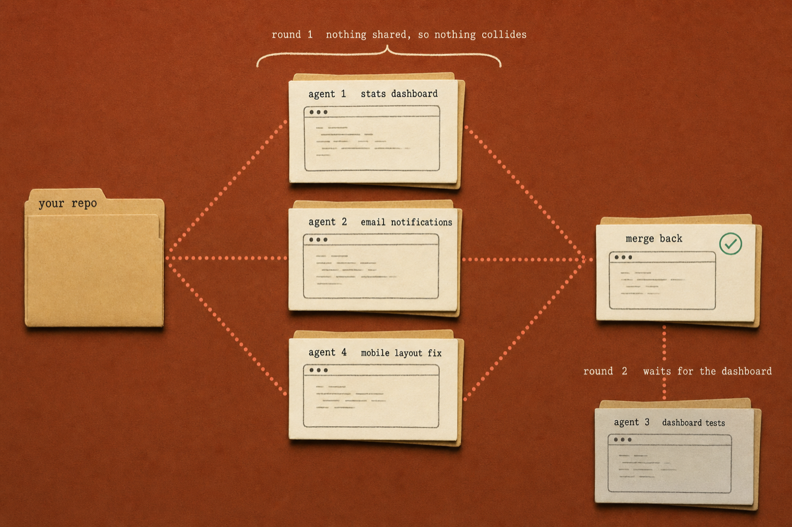

# Chapter 6: Power Features

Remote control, background agents, voice mode, LSP, MCP. `commands.md` has every command
with what you should see back. `parallel-work-map.md` is the thirty-second planning step
that makes background agents worth using at all.

Start with LSP: `npm install -D typescript`, then ask Claude
`Where is the deleteTask function defined?`. An instant `file:line` answer means it's
working. Watching Claude open five files first means it isn't.

Then `claude --remote-control "task-tracker"`, open the `/rc` panel, scan the QR with your
phone, give it a task from the couch. You're done with the chapter when you've sent Claude a
task from a device that isn't your terminal, and when two background agents have finished in
separate worktrees without touching the same file.

The isolation is the part that's easy to miss, and it's what transfers to your own project.
`--worktree` gives each agent a separate copy of the files, which is why two of them editing
at once is safe. Fill in your four rows in `parallel-work-map.md` before you start, not after
two agents have collided.

## What you need

Every `claude` command and every slash command here runs against your own Claude Code on a
paid plan. `/voice` is local only, so it won't work in the same remote session as the
couch-and-phone flow.
